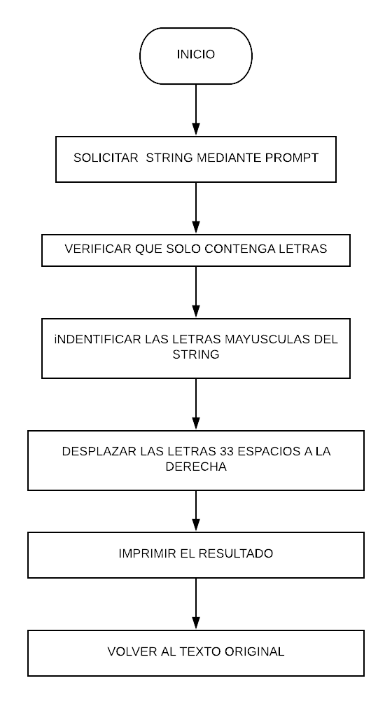

# CIFRADO CESAR
### DESCRIPCION:
Crea una web que pida, por medio de un prompt(), una frase al usuario y devuelva el mismo mensaje encriptado según el algoritmo de Cifrado César con el parámetro de desplazamiento de 33 espacios hacia la derecha

## PSEUDOCODIGO:

Entorno: parámetro de desplazamiento de 33 espacios hacia la derecha

1.- Solicitar un string

2.- Verificar que se solo contenga letras.

3.-Identificar las letras mayusculas del string.

4.- Desplazar las letras 33 espacios a la derecha.

5.- imprimir el resultado.

## DIAGRAMA DE FLUJO:

